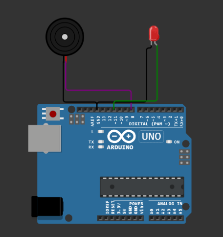
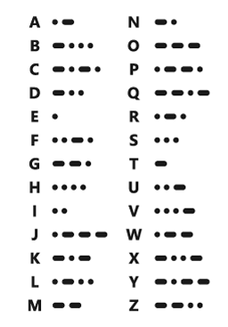

# Arduino Morse Code Translator
 Arduino Based Morse Code Translator. By typing the message in the text string it will reproduce the given message in Morse Code (dots and dashes).  For each letter in the message buzzer wil beep and the red LED will blink depending wheter it is dot (shorter blinks and beeps) or dash (longer blinks and beeps).
 
 Schematic:

Morse Code Table:

